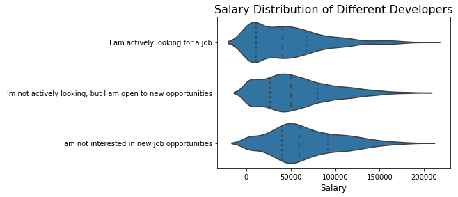
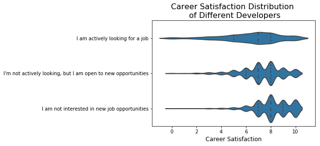
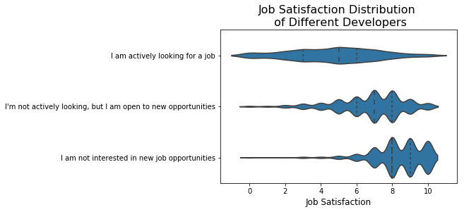
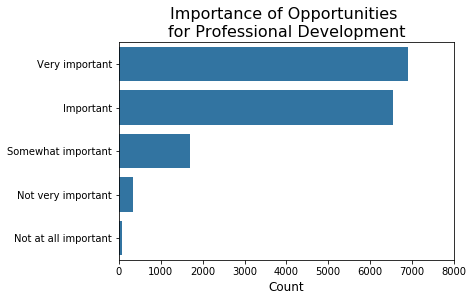
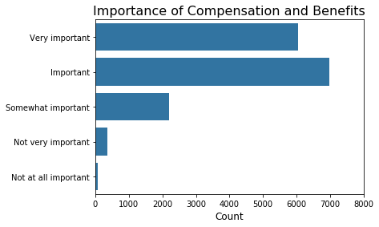
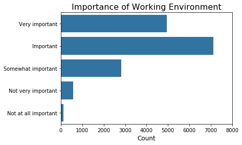
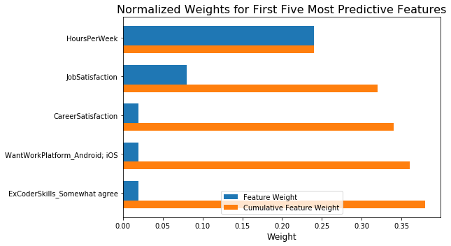

### Table of Contents

1. [Installation](#installation)
2. [Project Motivation](#motivation)
3. [File Descriptions](#files)
4. [Results](#results)
5. [Licensing, Authors, and Acknowledgements](#licensing)

## Installation 

There should be no necessary libraries to run the code here beyond the Anaconda distribution of Python.  The code should run with no issues using Python versions 3.*.

## Project Motivation

This project was inspired by a not-so-recent article in [Medium](https://towardsdatascience.com/why-so-many-data-scientists-are-leaving-their-jobs-a1f0329d7ea4) by a data scientist explaining why so many data scientists are leaving their jobs. For an aspiring data scientist like myself, it is important to know their frustrations so I can temper my expectations and be aware of my feelings towards the job.

Data scientists are similar to developers because they use tools and techniques to solve complex problems. For this project, Stack Overflow data from 2017 was used to better understand:

**1. How does salary and career/job satisfaction differ from developers who are actively looking and not actively looking for a new job?**

**2. What are the most important factors in assessing potential jobs to apply to?**

**3. Which factors would predict if developers will look for new jobs?**

## File Descriptions 

**1. WhyDevelopersLeave.ipynb**

This is the only Jupyter notebook here to showcase work related to the above questions.  This is exploratory in searching through the data pertaining to the questions showcased by the notebook title.  Markdown cells were used to assist in walking through the thought process for individual steps.  

**2. survey_results_public.csv.zip**

The first CSV file is directly sourced from [Kaggle](https://www.kaggle.com/stackoverflow/so-survey-2017) and contains the main survey results, one respondent per row and one column per answer. This is in a compressed format because the file is around 93 MB in size.

**3. survey_results_schema.csv**

The second CSV file includes the schema and lists all the questions used in the survey.

## Results

The main findings of the code can be found at this [post](https://medium.com/@lawrence.sumera/why-so-many-developers-are-leaving-their-jobs-d2ecd9557a88) available in Medium.

1. We looked at salary distribution and career/job distribution and discovered that developers who would likely quit are the least paid, and the least satisfied with their job and career. This is really unsurprising.

2. We then assessed which factors are the most important when finding potential jobs. The three most important in order are: opportunities for professional development, compensation & benefits, and working environment. Employers may want to focus on these to retain their developers.

3. Finally, we predicted that developers who spend the most time looking for new job opportunities, developers who have the lowest job and career satisfaction, are most likely going to quit. Developers who work in Android & iOS and have up-to-date coding skill are also most likely to change jobs. This reiterates the first point on satisfaction and while adding the importance of skills and coding platform.

## Licensing, Authors, Acknowledgements

Must give credit to Stack Overflow for the data and Udacity for guiding the creation of this repository and the blog post.  You can find the Licensing for the data and other descriptive information at the Kaggle link available above.

